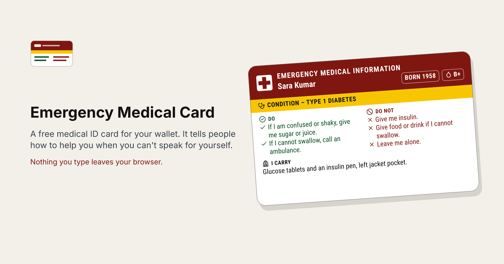

<p align="center"></p>

<h1 align="center">Emergency Medical Card</h1>

<p align="center">A free medical ID card maker. It makes a wallet card that tells people how to help you when you can't speak for yourself. Nothing you type leaves your browser.</p>

<p align="center"></p>

> [!WARNING]
> This is a tool for laying out a card. It isn't medical advice. Check everything you put on the card about your condition and your medicines with your doctor before you print it.

## Why it exists

My father lives with a long-term condition and he always carries a handwritten note in his pocket when he travels. Also, it was a hassle for him to explain his condition to non-native speakers at the airport. I wanted him to have a proper medical information card with enough useful information that a stranger could read in ten seconds and act upon. On the web, I couldn't find an easy way to design such an emergency medical info card, so I made one.

## What it does

You fill a form, and the card builds itself beside it as you type. When everything fits, you download it from the Download menu above the card.

- **PDF for a print shop.** Exact bank card size, 85.6 × 54 mm, or a pocket card at 105 × 74 mm with larger type. Every letter is a vector outline, so it prints the same on any machine with no fonts installed.
- **A sheet to print at home.** One A4 or Letter page, whichever your country uses, with the front above the back, corner marks to cut along, and a fold line between them.
- **PNG for your phone.** A lock screen image with the same information in one column at phone text size, placed below where the clock sits.
- **PNG, per side.** 300 or 600 dpi, with the physical size written into the file so print software gets it right.
- **SVG, per side.** For editing in any vector tool, with no fonts needed.

The card can be in one language, or in two with one on each side, from 47 languages. Latin, Greek, and Cyrillic are set in the typeface you pick in the Look menu. Indian scripts, Sinhala, Thai, Khmer, Lao, Myanmar, Georgian, Armenian, and Ethiopic each get a Noto font made for them, loaded only when you pick a language that needs it. HarfBuzz shapes every script, so letters combine and reorder the way the script expects.

The headings in every language except English were translated with AI, and no native speaker has checked them yet. The editor tells you so when you pick one, and [you can help check them](#check-the-headings-in-your-language). Arabic, Urdu, Persian, and Hebrew are in the list but can't be picked until right-to-left text works. Chinese, Japanese, and Korean wait on a way to ship fonts that are tens of megabytes each.

Pick a condition and the DO and DO NOT fields fill with suggested text, drafted with AI from public first aid pages that are named beside the field. No clinician has reviewed it yet. The editor says so, and when you change the text it warns you to check the wording with your doctor.

## Privacy

Everything you type stays in your browser. There's no account, cookie, or tracking script, and the page loads nothing from any other company. Your card is saved in the browser's own storage. You can save a copy as a file from the File menu and open it on any device. The host, Cloudflare, counts visits and the countries they come from, as every web host does, and nothing you type is part of those requests. The privacy page on the site has the details.

## Emergency numbers

Pick your country and the card prints its emergency number, and a second ambulance number where there is one. The table in [src/data/emergency-numbers.json](src/data/emergency-numbers.json) covers 117 countries. Each entry names the public page it was checked against (a government, regulator, or emergency service page, or a foreign ministry's travel advice) and the date someone checked it. Numbers change, and the editor shows that date so you can check yours.

If a number is wrong, [open an issue](https://github.com/KarthikeyanKC/emergency-medical-card/issues/new?template=emergency-number.yml) with the official page that says so, or send a pull request that changes the entry, its `source`, and its `lastVerified` date. The tests reject an entry without a source, and anything in a number field that isn't digits.

## Printing

Hand the PDF to a print shop and ask for 100% scale, no fit-to-page, 250 gsm or heavier matte card or PVC, laminated, with the corners rounded to about 3 mm.

Or print the home sheet yourself at 100% or Actual size. Cut along the corner marks, fold along the line so the back sits behind the front, and laminate it. The [print guide](docs/print-guide.md) has the details.

## Run it yourself

```
npm install
npm run dev
```

`npm run build` writes a static site to `dist/`, ready for any static host. Set `SITE_URL` at build time to get canonical URLs, absolute social images, and a sitemap. On Cloudflare Pages, the build command is `npm run build`, the output folder is `dist`, and the environment needs `SITE_URL` and `NODE_VERSION=22`.

```
npm test                  # unit tests
npm run check             # docs check, tests, then build
node scripts/smoke.mjs    # browser test against a running preview or dev server
node scripts/layout.mjs   # layout check at seven screen sizes
node scripts/a11y.mjs     # axe audit and keyboard walk
```

`npm install` also points git at `.githooks/`, so every commit runs the tests and `npm run docs:check`. The docs check fails when a document drifts from the code, such as a dead file path, a wrong count, or a CSP that no longer matches. The same checks run on every pull request.

## How it is built

Astro, vanilla JavaScript, and Tailwind CSS 4. One renderer turns the card's state into an SVG. The preview shows that SVG and every export is made from it. Text is shaped by HarfBuzz compiled to WebAssembly and converted to paths, which is how Tamil and other languages come out right in a PDF.

## Contributing

[AGENTS.md](AGENTS.md) is the specification, so read it before changing anything. [CONTRIBUTING.md](CONTRIBUTING.md) says how to add a language, a condition, a font, or a card size, and how to correct an emergency number.

### Check the headings in your language

The card can be in any of the 47 languages that are available. The headings for every one of them except English were translated with AI, and none has been checked by a native speaker yet. A file that has been checked is marked `_reviewed: true`, and so far that's only English.

If you read one of these languages natively, open the site, pick it in the Language menu above the card, and read the headings on the preview. The card prints them in capitals, so read them there and not in the JSON. Then please tell me what's wrong, or that it all reads right, with the [Check a translation](https://github.com/KarthikeyanKC/emergency-medical-card/issues/new?template=translation.yml) form.

## Licence

The code is under the [MIT licence](LICENSE). Fonts, icons, and symbols carry their own licences, listed in [NOTICE.md](NOTICE.md).

The data has its own licences.

- The emergency number table and the paper-size list are facts, released under [CC0 1.0](https://creativecommons.org/publicdomain/zero/1.0/). Use them anywhere.
- The condition catalogue's suggested text and the card headings in each language are under [CC BY 4.0](https://creativecommons.org/licenses/by/4.0/). Use them anywhere, and credit this project. The condition names and aliases come from Wikidata under CC0.

Made by [Karthikeyan KC](https://github.com/KarthikeyanKC).
